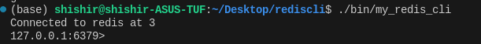

# Introduction 
---
This Project aims to build a RESP compliant Redis Command Line Interface that can communicate with redis servers. At the moment only things till RESP2 work, plan to include RESP3 communication in the future. Follow the steps to use the project:-

- Install the official redis-server or download my custom redis server binary file [Download](https://github.com/shishir-11/RedisServer/blob/ffcf300ab05950a7e6f6f7d029ceb23ede43c503/bin/server)

- Start the redis server using `redis-server` for official or `./redis-server` for the downloaded one. 
- Clone this repository. open root of repo in terminal and run `make` to build the binary and run it.
```
$ git clone https://github.com/shishir-11/RedisClient.git
$ cd RedisClient
$ make
$ ./bin/my_redis_cli
```
This would start up the CLI and you would see something like 

Now run a few commands like `info` or `ping` to confirm connection.
It is ready to run all redis commands.
